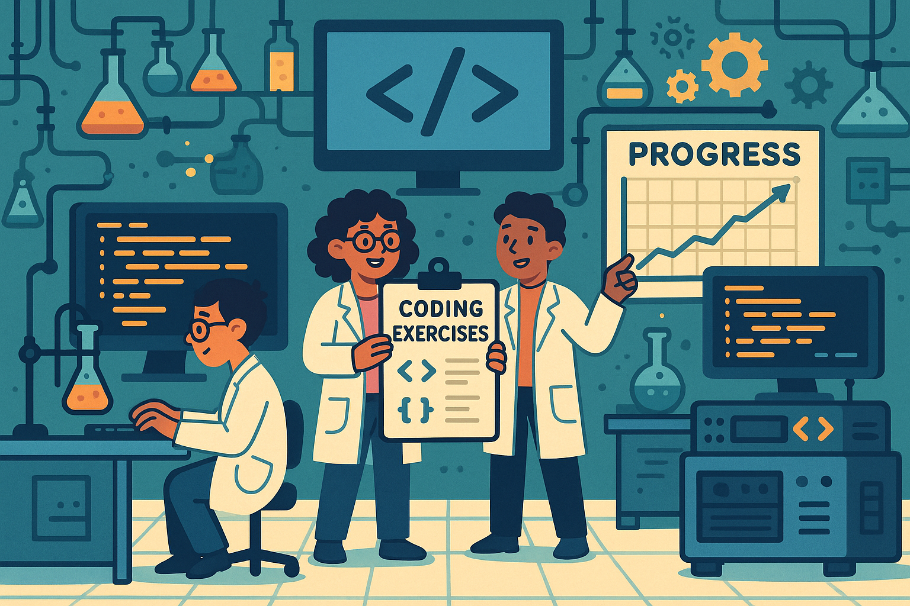

# Laboratory
Coding exercises to build muscle memory. No AI tools or copy-pasting allowed :)
Why?:
- [ChatGPT: The cognitive effects on learning and memory](https://onlinelibrary.wiley.com/doi/full/10.1002/brx2.30)
- [MIT Study Your Brain on ChatGPT](https://www.media.mit.edu/publications/your-brain-on-chatgpt/)

